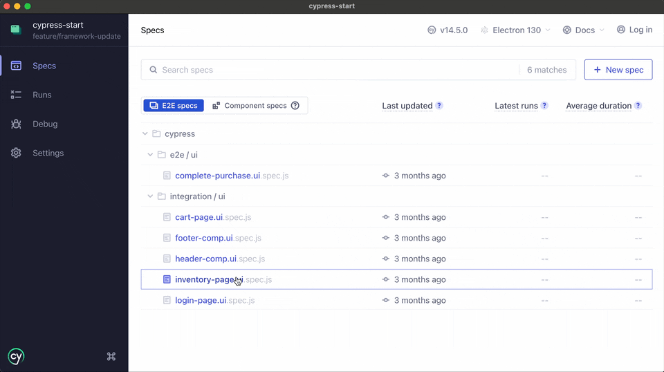

# Cypress Testing Framework

<p align="center">
    <picture>
      <source media="(prefers-color-scheme: dark)"  srcset="./assets/cypress-logo-dark.png">
      <source media="(prefers-color-scheme: light)" srcset="./assets/cypress-logo-light.png">
      
    </picture>
</p>

## Table of Contents

- [Overview](#overview)
- [What Makes This Framework Unique?](#what-makes-this-framework-unique)
- [Features](#features)
- [Getting Started](#getting-started)
- [Running Tests](#running-tests)
- [Development Guidelines](#development-guidelines)
- [Quality Standards](#quality-standards)
- [Troubleshooting](#troubleshooting)

## Overview

Unlock rapid and reliable testing with framework, developed using Cypress and JavaScript. Designed to scale
effortlessly, it is suitable for projects of any size. 
This framework includes examples of tests: 
- Integration and E2E UI tests for the [Swag Labs Demo application](https://www.saucedemo.com/).
- Integration API tests [Restful Booker API playground](https://restful-booker.herokuapp.com/apidoc/)



---

## What Makes This Framework Unique?

- **No Abstractions**: No redundant abstraction layers such as Page Object Models or BDD frameworks. The framework
  provides a defined structure and naming conventions, using Gherkin syntax to make tests self-descriptive, readable, and
  understandable for non-technical personnel.
- **Comprehensive Use Case Documentation**: All business use cases are described in detail, regardless of their
  automation status. This approach provides accurate coverage metrics, eliminates test gaps, and serves as a solid source of truth
  for the entire team.
- **Scalability**: The simple yet efficient approach makes the framework easily extendable for future needs.
- **Maintainability**: Clear project structure and comprehensive documentation for easy onboarding,
  effortless maintenance, and test writing.
- **Robustness**: Designed with Cypress to handle complex test scenarios with ease.
- **Lightweight and Easy Startup**: Quick setup with minimal configuration. The low number of third-party dependencies
  helps avoid conflicts and ensures fast build times.

---

## Features

- **Custom ESLint Rules:** Enforces strict test structure and naming conventions, preventing duplicate or invalid test
  titles.  
  See [Custom ESLint Rules](docs/eslint-custom-rules.md).
- **Localization Testing:** Dynamically loads and validates localization files, supporting multi-language test runs.  
  See [Localization Testing](docs/localization-testing.md).
- **Color Theme Testing:** Easily test across multiple color themes using environment variables.  
  See [Color Theme Testing](docs/colour-theme-testing.md).
- **Centralized Selector Management:** All selectors are managed in a single location for maintainability and
  consistency.
- **Pre-commit Quality Checks:** Automated linting and code quality checks before every commit.  
  See [Pre-commit Check](docs/pre-commit-check.md).
- **Test Structure Guidelines:** Detailed documentation for writing maintainable, readable, and robust tests.  
  See [Test Writing Guideline](docs/test-writing-guideline.md), [Naming Conventions](docs/naming-conventions.md), [Tagging Strategy](docs/tagging-strategy.md), [FAQ](docs/faq.md).
- **Copilot Integration:** AI-assisted test writing with ready-to-use instructions.  
  See [Copilot Instructions](.github/copilot-instructions.md).
- **Copilot Prompts:** Ready-to-use prompts for AI-assisted test writing.  
  See [Copilot Prompts](docs/copilot-prompts.md).
- **Prepared Continuous Integration Sample:** Weekly regression test workflow integrated for automated test execution.
  See [Weekly Cypress Tests Workflow](.github/workflows/weekly-cypress-tests.yml).

---

## Getting Started

### Prerequisites

- Node.js (latest LTS version)
- npm or yarn
- Git

### Installation

1. Clone the repository:

   ```bash
   git clone <repository-url>
   cd cypress-start
   ```

2. Install dependencies:

   ```bash
   npm install
   ```

3. Set up sensitive data:

    - Copy `cypress/sensitive-data/env-users.example.json` to `cypress/sensitive-data/dev-users.json` to provide test
      user credentials for the test environment.

---

## Running Tests

### Standard Test Run

To run tests with default settings in headless mode:

```bash
  npm run test
```

To run tests with specific language and environment parameters in headless mode:

#### Windows:

```bash
  $env:LANGUAGE="en"; $env:COLOUR_THEME="default"; $env:TARGET_ENV="qa"; $env:BROWSER="chrome"; npm run test
```

#### macOS:

```bash
  LANGUAGE=en COLOUR_THEME=default TARGET_ENV=dev BROWSER=electron npm run test
```

---

Available environment parameters:

- `LANGUAGE`: Specifies the language code (defaults to `en`)
- `TARGET_ENV`: Specifies the target environment (defaults to `dev`)
- `COLOUR_THEME`: Specifies the colour theme to use (defaults to `default`)

### Debug Mode

For interactive debugging with the Cypress UI:

#### Windows:

```bash
  $env:LANGUAGE="en"; $env:TARGET_ENV="dev"; $env:COLOUR_THEME="default"; npm run pretest; npx cypress open
```

#### macOS with caffeinate (prevents system from sleeping):

```bash
  LANGUAGE=en COLOUR_THEME=default npm run pretest && TARGET_ENV=dev caffeinate -i npx cypress open
```

---

## Development Guidelines

- [Test Writing Guideline](docs/test-writing-guideline.md)
- [FAQ](docs/faq.md)
- [Naming Conventions](docs/naming-conventions.md)
- [Git Strategy](docs/git-strategy.md)
- [Bug Tracking](docs/bug-tracking.md)
- [Localization Testing](docs/localization-testing.md)
- [Color Theme Testing](docs/colour-theme-testing.md)
- [Copilot Prompts](docs/copilot-prompts.md)
- [Copilot Instructions](.github/copilot-instructions.md)
- [Copilot Instructions for Integration API Tests](.github/instructions/integration-api-tests.instructions.md)
- [Copilot Instructions for Integration UI Tests](.github/instructions/integration-ui-tests.instructions.md)
- [Copilot Instructions for E2E UI Tests](.github/instructions/e2e-ui-tests.instructions.md)

---

## Quality Standards

- [Custom ESLint Rules](docs/eslint-custom-rules.md)
- [Pre-commit Check](docs/pre-commit-check.md)
- [Tagging Strategy](docs/tagging-strategy.md)

---

## Troubleshooting

### Common Issues

- **Pretest script fails:** Ensure you have the correct language and theme files in the appropriate directories.
- **Test isolation issues:** Check that `testIsolation: false` is set on the relevant `describe` blocks.
- **Localization errors:** Verify that the language file contains all required keys.
- **ESLint errors:** Run `npm run lint` to identify specific issues.

### Updating Dependencies

To update all dependencies to their latest versions:

```bash
  npx npm-check-updates -u
```

Then, reinstall the dependencies:

```bash
  npm install
```
 