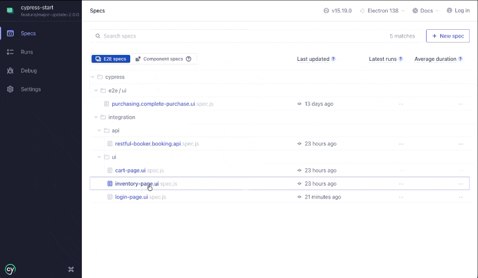

# Cypress Testing Framework

<p style="text-align: center;">  
    <picture>
      <source media="(prefers-color-scheme: dark)"  srcset="./assets/cypress-logo-dark.png">
      <source media="(prefers-color-scheme: light)" srcset="./assets/cypress-logo-light.png">
      
    </picture>
</p>

## Table of Contents

- [Quick Start](#quick-start)
- [Overview](#overview)
- [What Makes This Framework Unique?](#what-makes-this-framework-unique)
- [Features](#features)
- [Running Tests](#running-tests)
    - [Standard Test Run](#standard-test-run)
    - [Parallel Test Execution](#parallel-test-execution)
    - [Environment-Specific Test Run](#environment-specific-test-run)
    - [Debug Mode](#debug-mode)
    - [GitHub Actions Workflow](#github-actions-workflow)
- [Documentation](#documentation)
- [Troubleshooting](#troubleshooting)

## Quick Start

Create a new project from this template in seconds! The CLI offers two setup modes to match your needs:

### Prerequisites

- Node.js (latest LTS version)
- npm or yarn
- Git

### 🚀 Create New Project with cypress-start CLI (Recommended)

```bash
# Using npx (no installation required)
npx cypress-start my-project

# Or install globally first
npm install -g cypress-start
cypress-start my-project
```

The CLI guides you through two setup modes:

#### 🎯 Mode 1: Full Setup (Recommended)

Complete framework with all features, tests, and data. Git initialized, dependencies auto-installed.  
**Best for:** New standalone projects.

#### 📦 Mode 2: Specific Files

Cherry-pick modules (ESLint, Docs, Copilot, Parallel Runner, GitHub Actions, Docker) for existing projects.  
Package.json updated automatically. Manual `npm install` required.  
**Best for:** Adding features to existing projects.

```bash
cd my-project
npm run test              # Run all tests
npm run test:parallel     # Run tests in parallel
npm run lint              # Run ESLint checks
npx cypress open          # Open Cypress UI
```

### Alternative Setup Methods

**GitHub Template:**

1. Click **"Use this template"** → "Create a new repository"
2. Clone: `git clone https://github.com/YOUR-USERNAME/your-repo-name.git`

**Direct Clone:**

```bash
git clone https://github.com/IvanZdanovich/cypress-start.git my-project
cd my-project
```

**Post-Setup:**

```bash
npm install  # Installs dependencies and sets up pre-commit hooks
```

Copy `cypress/sensitive-data/env-users.example.json` to `cypress/sensitive-data/dev-users.json` for test credentials.

---

### Mode Comparison

**Full Setup** targets new standalone projects. It includes all test files and test data, initializes Git, runs `npm install` automatically, and is ready to use immediately.

**Specific Files** targets existing projects where you want to add individual modules. Test files and test data are not included — you choose which modules to add and run `npm install` manually after setup.

Both modes produce a complete `package.json` (created or merged).

---

## Overview

Unlock rapid and reliable testing with a framework developed using Cypress and JavaScript. Designed to scale
effortlessly, it is suitable for projects of any size.
This framework includes examples of tests:

- Integration and E2E UI tests for the [Swag Labs Demo application](https://www.saucedemo.com/).
- Integration API tests for the [Restful Booker API playground](https://restful-booker.herokuapp.com/apidoc/)



---

## What Makes This Framework Unique?

- **The Spec Is the Requirement**: Tests follow a Constraints → Examples → Specs traceability model. Boundary values live in constraint files, named data instances in example files, and requirements as executable Given/When/Then titles in spec files. There are no separate requirement documents, mapping matrices, or test-management tools — the spec is the single source of truth. ([docs](docs/requirements-examples-approach.md))
- **No Abstractions**: No redundant abstraction layers such as Page Object Models or BDD frameworks. The framework provides a clear structure and naming conventions while using Gherkin‑style syntax to make tests self‑descriptive, readable, and understandable for non‑technical stakeholders.
- **Efficiency**: Parallel test execution and optimized configurations ensure fast feedback cycles.
- **Scalability**: Proper test organization and file isolation avoid manual test case structures. Straightforward test‑data organization and custom static code analysis rules enforce naming conventions and test structure. The framework aligns the entire team around well‑defined requirements and scales effortlessly with the project.
- **Type-Safe Localization and Color Themes**: Locale and theme files are compiled into typed maps at pretest time. Missing or misspelled keys are caught by the linter before a test ever runs.
- **Maintainability**: A clear project structure and comprehensive documentation ensure easy onboarding, effortless maintenance, and smooth test creation.
- **Robustness**: Designed with Cypress to handle complex test scenarios with ease.
- **Lightweight and Easy Startup**: Quick setup with minimal configuration. A minimal number of third‑party dependencies helps avoid conflicts and ensures fast build times.

---

## Features

- **Interactive CLI Setup:** Two setup modes — Full Setup (complete framework) or Specific Files (cherry-pick modules)
- **Parallel Test Execution:** Run tests in parallel with configurable stream count ([docs](docs/parallel-execution.md))
- **Localization Testing:** Type-safe localization with auto-generated typed `l10n` map from locale files ([docs](docs/localization-testing.md))
- **Color Theme Testing:** Type-safe color themes with auto-generated typed `colours` map from theme files ([docs](docs/colour-theme-testing.md))
- **Coverage Gap Analysis:** Compares implemented tests against the expected structure, reporting missing paths, skipped tests, and coverage percentages with CI threshold enforcement ([docs](docs/coverage-gap-analysis.md))
- **Flaky Test Analysis:** Persists CI test outcomes across runs in an orphan-branch ledger, then classifies tests as flaky, consistent, or rare ([docs](docs/flaky-test-analysis.md))
- **Custom ESLint Rules:** Enforces test structure and naming conventions ([docs](docs/eslint-custom-rules.md))
- **Pre-commit Quality Checks:** Automated linting before every commit ([docs](docs/pre-commit-check.md))
- **CI/CD Integration:** GitHub Actions workflow with dynamic test filtering and Docker support

---

## Running Tests

### Standard Test Run

To run tests with default settings in headless mode:

```bash
npm run test
```

### Parallel Test Execution

To run tests in parallel for faster execution:

```bash
# Default (3 parallel streams)
npm run test:parallel

# Custom stream count
PARALLEL_STREAMS=6 npm run test:parallel
```

### Environment-Specific Test Run

Run tests with specific environment parameters in headless mode.

**Environment Parameters:**

- `LANGUAGE`: Language code (default: `en`)
- `TARGET_ENV`: Target environment (default: `dev`)
- `COLOUR_THEME`: Color theme (default: `default`)
- `BROWSER`: Browser for execution (default: `electron`, options: `electron`, `chrome`, `edge`, `firefox`)

**Windows (PowerShell):**

```powershell
$env:LANGUAGE="en"; $env:COLOUR_THEME="default"; $env:TARGET_ENV="qa"; $env:BROWSER="electron"; npm run test
```

**Windows (CMD):**

```cmd
set LANGUAGE=en&& set COLOUR_THEME=default&& set TARGET_ENV=qa&& set BROWSER=electron&& npm run test
```

**macOS/Linux:**

```bash
LANGUAGE=en COLOUR_THEME=default TARGET_ENV=dev BROWSER=electron npm run test
```

### Debug Mode

For interactive debugging with the Cypress UI:

**Windows (PowerShell):**

```powershell
$env:LANGUAGE="en"; $env:TARGET_ENV="dev"; $env:COLOUR_THEME="default"; npm run pretest; npx cypress open
```

**Windows (CMD):**

```cmd
set LANGUAGE=en&& set TARGET_ENV=dev&& set COLOUR_THEME=default&& npm run pretest&& npx cypress open
```

**macOS/Linux:**

```bash
LANGUAGE=en COLOUR_THEME=default npm run pretest && TARGET_ENV=dev caffeinate -i npx cypress open
```

---

### GitHub Actions Workflow

Automated CI/CD workflow with weekly scheduled runs or manual triggers.

**Quick Start:**

1. Go to **Actions** tab → Select **"Weekly Cypress Tests"**
2. Click **"Run workflow"** → Configure parameters → Click **"Run workflow"**

**Available Parameters:**

- `language` — Language code (default: `en`)
- `target_env` — Target environment (default: `dev`)
- `colour_theme` — Color theme (default: `default`)
- `parallel_streams` — Number of parallel streams, 1–6 (default: `3`)
- `browser` — Browser to use: `electron`, `chrome`, `firefox`, `edge` (default: `electron`)
- `test_scope` — Scope of tests to run: `all`, `integration`, `e2e` (default: `all`)
- `test_type` — Type of tests to run: `all`, `api`, `ui` (default: `all`)

**Test Filtering:**

- `all` scope + `all` type → all tests in the workspace
- `all` scope + `api` type → all API tests (integration only)
- `all` scope + `ui` type → all UI tests (integration + e2e)
- `integration` scope + `all` type → all integration tests (api + ui)
- `integration` scope + `api` type → integration API tests only
- `integration` scope + `ui` type → integration UI tests only
- `e2e` scope + `all` type → all E2E tests
- `e2e` scope + `ui` type → E2E UI tests only

**Viewing Results:** Check the **Actions** tab for run status. Download artifacts (reports, screenshots, videos) after completion.

---

## Documentation

**Test Development:**

- [Constraints → Examples → Specs](docs/requirements-examples-approach.md)
- [CES vs. Traditional RM Tools](docs/approach-comparison-spec-vs-rm-tool.md)
- [FAQ](docs/faq.md)

**Features & Tools:**

- [Parallel Execution Guide](docs/parallel-execution.md)
- [Localization Testing](docs/localization-testing.md)
- [Color Theme Testing](docs/colour-theme-testing.md)
- [Coverage Gap Analysis](docs/coverage-gap-analysis.md)
- [Flaky Test Analysis](docs/flaky-test-analysis.md)

**Quality & Standards:**

- [Custom ESLint Rules](docs/eslint-custom-rules.md)
- [Pre-commit Check](docs/pre-commit-check.md)

**Git & Collaboration:**

- [Git Strategy](docs/git-strategy.md)

---

## Troubleshooting

### Common Issues

- **Pretest script fails:** Ensure you have the correct language and theme files in the appropriate directories.
- **Test isolation issues:** Check that `testIsolation: false` is set on the relevant `describe` blocks.
- **Localization errors:** Verify that the language file contains all required keys.
- **ESLint errors:** Run `npm run lint` to identify specific issues.

### Updating Dependencies

To update all dependencies to their latest versions:

```bash
npx npm-check-updates -u
```

Then reinstall the dependencies:

```bash
npm install
```